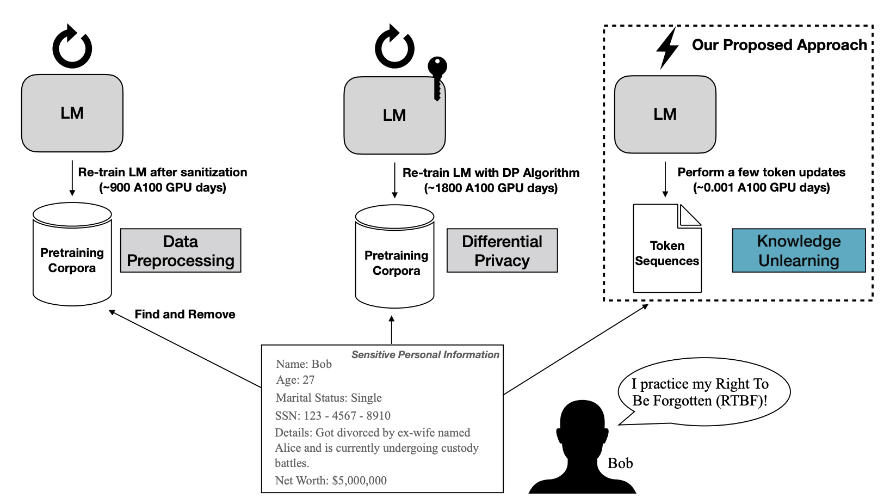

# Knowledge Unlearning for Mitigating Privacy Risks in Langauge Models



paper link: https://arxiv.org/abs/2210.01504

In order to reproduce our results, take the following steps:
### 1. Create conda environment and install requirements
```
conda create -n ufl python=3.8
conda activate ufl
# Install the correct torch version depending on CUDA version from https://pytorch.org/
conda install pytorch torchvision torchaudio cudatoolkit=11.3 -c pytorch 
pip install -r requirements.txt
```

### 2. In order to run the basic code, use the following command
```
python run.py --config configs/example.json
```

### 3. Reproducing Experimental Results

**Configs**
- mode (string) : Either "unlearn" or "general_lm_eval"
  - "unlearn" will measure MA and EL for validation sets with valid_type_path == "target", for others it will run normal evaluation
  - "general_lm_eval" will run normal evaluation for all validation sets, only use when not evaulating the target data (the data that should be unlearned) 
- check_validation_only (bool) : If true, a single validation loop will run without training
- do_init_eval (bool) : Whether to run a single validation loop before training
- train_set (string) : Path to train_set, should be a .csv file
- valid_sets (list[string]) : List containing validation set info
  - Could either be a .csv file path, or the dataset name on Huggingface hub
- valid_subset_path (list[string]) : Subset name of the dataset from HF hub
  - If it does not have a subset, or is a .csv file the string will be ignored
- valid_type_path (list[string]) : Type of the valdiation data
  - If it's the target data pass "target"
  - If it's a HF hub data pass the appropriate type
  - If it's a .csv file the string will be ignored
- el_n (list[int]) : list of n values for EL
- el_threshold (float) : The models EL score for unseen data, exact values for each models in paper
- ma_threshold (float) : The models MA score for unseen data, exact values for each models in paper
- min_train_epochs (int) : Guarantees the minimum amount of epochs
  - By default the model will stop training when it reaches both el_threshold and ma_threshold
  - This configuration will give some control over this behaviour
- target_length (int) : The token length of the unlearning target data
- input_length, output_length (int) : The token length of the input, output for LM evaluation tasks
- strategy : Strategy passed to Lightning Trainer()
  - The code was tested with "deepspeed_stage_2" and "deepspeed_stage_2_offload"
  
**Note**
- The effective batch size (train_batch_size * gradient_accumulation_steps * ngpu) should be identical to the train set size
  - We found that minimizing gradient updates is crucial for retaining LM performance
  - If "effective batch size" != "train set size" the code will throw an error
- The eval_batch_size will be replaced with train_batch_size only for "target" data, because "target" data are usually much smaller than LM eval data
  - This also speeds up the evaluation, because it guarantees a single eval step
- The code will save two .csv files to "outputs/". They contain MA and EL scores for each individual examples within the target data
  - One contains the validation results measured before training
  - The other contains the validation results throughout training
